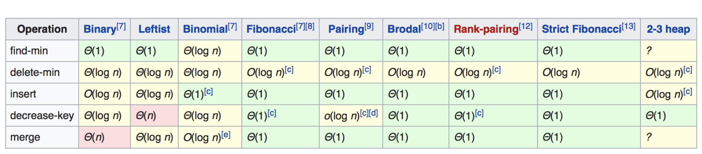

1. Stack - First In Last Out (FILO) • Array or Linked List
2. Queue - First In First Out (FIFO) • Array or Linked List
3. PriorityQueue - 优先队列列 • 正常⼊入、按照优先级出

# 优先队列内部实现

1. Heap (Binary, Binomial, Fibonacci) 
2. Binary Search Tree

# 堆 

## Mini Heap

## Max Heap

## 常见堆的各种实现的复杂度

注：黄色性能一般；红色性能很差

# 补充
java中的优先队列就是用堆是实现的
二叉堆在所有堆中性能是最差的，各个语言中一般用Fibonacci堆或者红黑树代替。