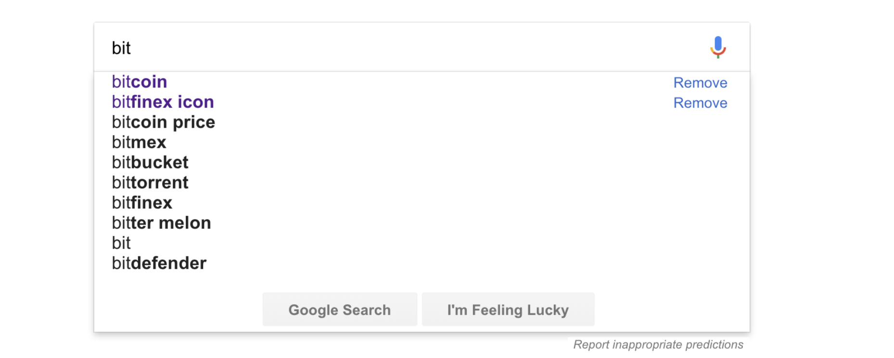
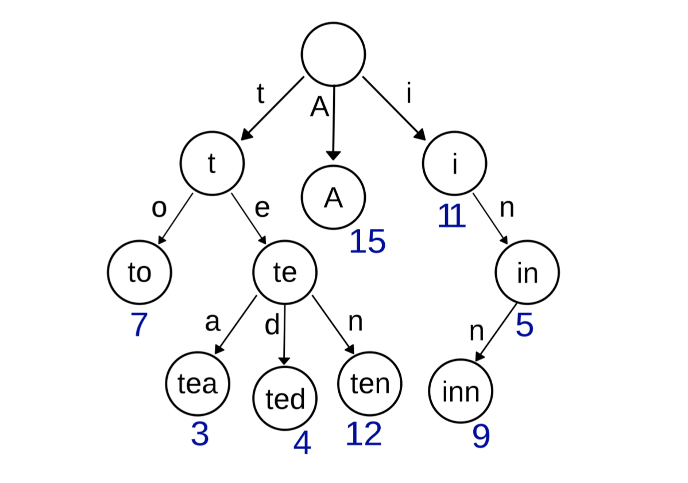
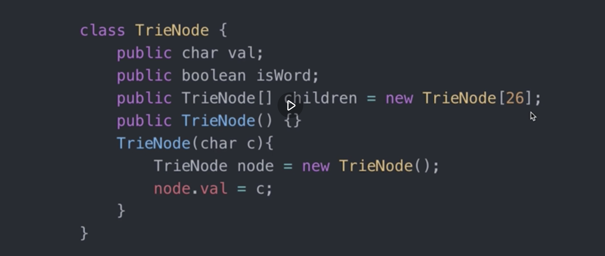

# 字典树



## 基本结构

Trie树，即字典树，⼜又称单词查找树或 键树，是⼀一种树形结构，是⼀一种哈希 树的变种。典型应⽤用是⽤用于统计和排 序⼤大量量的字符串串(但不不仅限于字符 串串)，所以经常被搜索引擎系统⽤用于 ⽂文本词频统计。



字典树与字典很相似,当你要查一个单词是不是在字典树中,首先看单词的第一个字母是不是在字典的第一层,如果不在,说明字典树里没有该单词,如果在就在该字母的孩子节点里找是不是有单词的第二个字母,没有说明没有该单词,有的话用同样的方法继续查找.字典树不仅可以用来储存字母,也可以储存数字等其它数据。

它的优点是:最⼤大限度地减少⽆无谓的 字符串串⽐比较，查询效率⽐比哈希表⾼高。

## 基本性质
1. 根节点不不包含字符，除根节点外每⼀一个节点都只包含⼀一 个字符。
2. 从根节点到某⼀一节点，路路径上经过的字符连接起来，为 该节点对应的字符串串。
3. 每个节点的所有⼦子节点包含的字符都不不相同。

## 字典树数据结构

 

## 代码实现

```
//字典树的java实现
    public class Trie {
        private TrieNode root;

        public Trie() {
            root = new TrieNode();
            root.wordEnd = false;
        }

        public void insert(String word) {
            TrieNode node = root;
            for (int i = 0; i < word.length(); i++) {
                Character c = new Character(word.charAt(i));
                if (!node.childdren.containsKey(c)) {
                    node.childdren.put(c, new TrieNode());
                }
                node = node.childdren.get(c);
            }
            node.wordEnd = true;
        }

        public boolean search(String word) {
            TrieNode node = root;
            boolean found = true;
            for (int i = 0; i < word.length(); i++) {
                Character c = new Character(word.charAt(i));
                if (!node.childdren.containsKey(c)) {
                    return false;
                }
                node = node.childdren.get(c);
            }
            return found && node.wordEnd;
        }

        public boolean startsWith(String prefix) {
            TrieNode node = root;
            boolean found = true;
            for (int i = 0; i < prefix.length(); i++) {
                Character c = new Character(prefix.charAt(i));
                if (!node.childdren.containsKey(c)) {
                    return false;
                }
                node = node.childdren.get(c);
            }
            return found;
        }

    }

    public class TrieNode {
        Map<Character, TrieNode> childdren;
        boolean wordEnd;

        public TrieNode() {
            childdren = new HashMap<Character, TrieNode>();
            wordEnd = false;
        }
    }
```