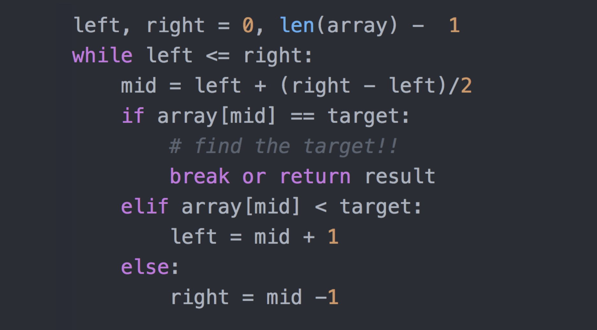

# 二分查找

使用条件：查找序列是顺序结构，有序。

思想：有序的序列，每次都是以序列的中间位置的数来与待查找的关键字进行比较，每次缩小一半的查找范围，直到匹配成功。

采用的是分治策略

最坏的情况下两种方式时间复杂度一样：O(log2 N)

二分查找代码模板



# 递归方式

```
	/**
	 * 使用递归的二分查找
	 *title:recursionBinarySearch
	 *@param arr 有序数组
	 *@param key 待查找关键字
	 *@return 找到的位置
	 */
	public static int recursionBinarySearch(int[] arr,int key,int low,int high){
		
		if(key < arr[low] || key > arr[high] || low > high){
			return -1;				
		}
		
		int middle = (low + high) / 2;			//初始中间位置
		if(arr[middle] > key){
			//比关键字大则关键字在左区域
			return recursionBinarySearch(arr, key, low, middle - 1);
		}else if(arr[middle] < key){
			//比关键字小则关键字在右区域
			return recursionBinarySearch(arr, key, middle + 1, high);
		}else {
			return middle;
		}	
		
	}
```

# 非递归方式

```
	/**
	 * 不使用递归的二分查找
	 *title:commonBinarySearch
	 *@param arr
	 *@param key
	 *@return 关键字位置
	 */
	public static int commonBinarySearch(int[] arr,int key){
		int low = 0;
		int high = arr.length - 1;
		int middle = 0;			//定义middle
		
		if(key < arr[low] || key > arr[high] || low > high){
			return -1;				
		}
		
		while(low <= high){
			middle = (low + high) / 2;
			if(arr[middle] > key){
				//比关键字大则关键字在左区域
				high = middle - 1;
			}else if(arr[middle] < key){
				//比关键字小则关键字在右区域
				low = middle + 1;
			}else{
				return middle;
			}
		}
		
		return -1;		//最后仍然没有找到，则返回-1
	}
```