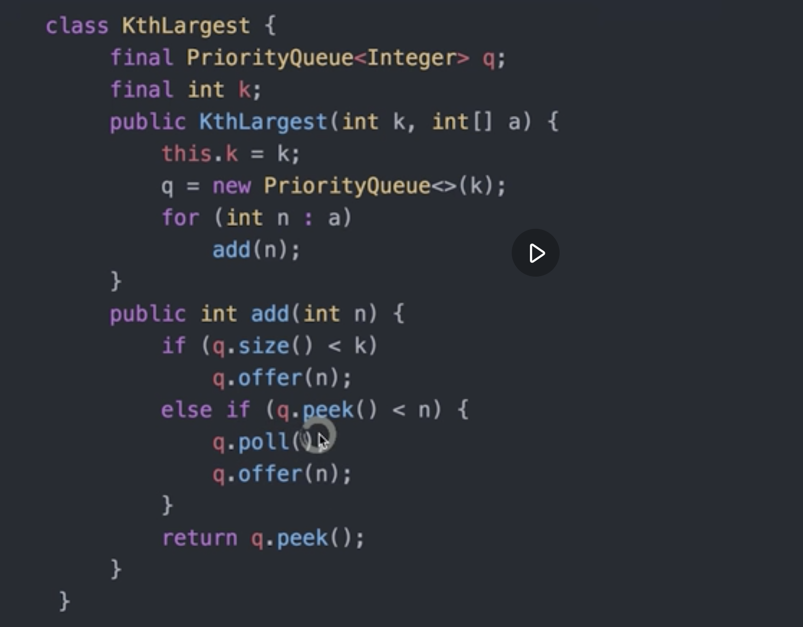

流数据中的第K大数，[4, 5, 8, 2 ...]

# 思路：

## 思路1：排序
如果要求最大的数，只需要记录最大的值即可，时间复杂度O(N)；
则要求第K大的数，只需要将前K大的数记录下来，维护一个长度为K的有序的数组，针对需要判断的每个数字，把他放进有序数组中即可，时间复杂度：O(K*logK) [排序的复杂度 NlogN]

## 思路2：优先队列(堆)
始终维护一个长度为K的小顶堆，如果来一个元素比堆顶的要小，则忽略；否则放进堆中，并调整堆即可。时间复杂度: N(logK)

# 代码实现

