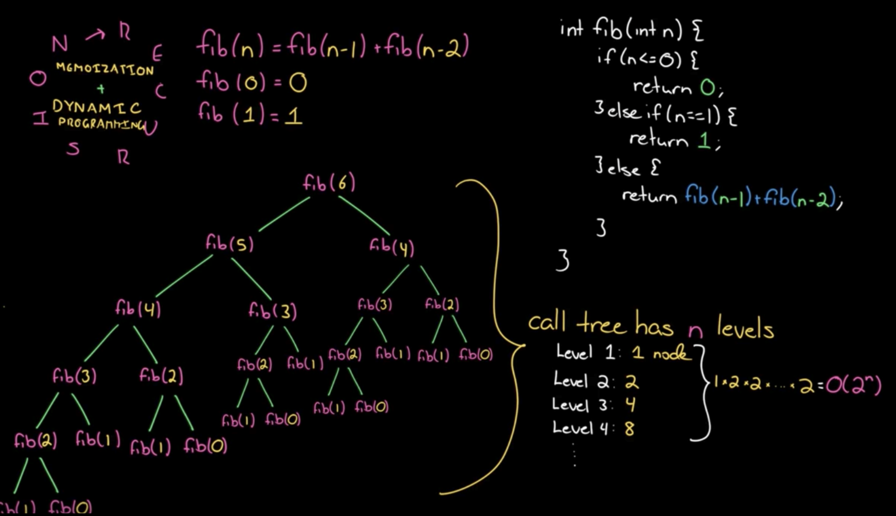
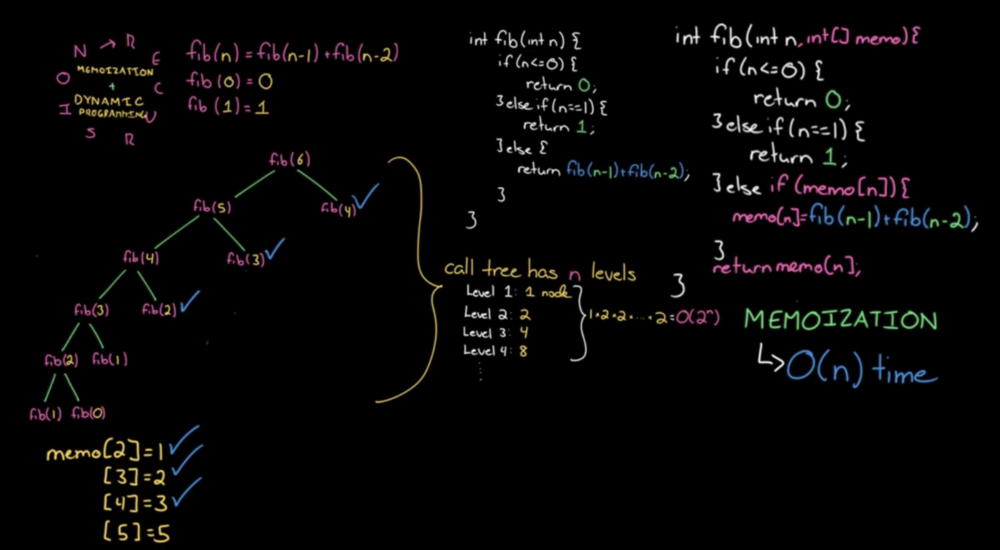
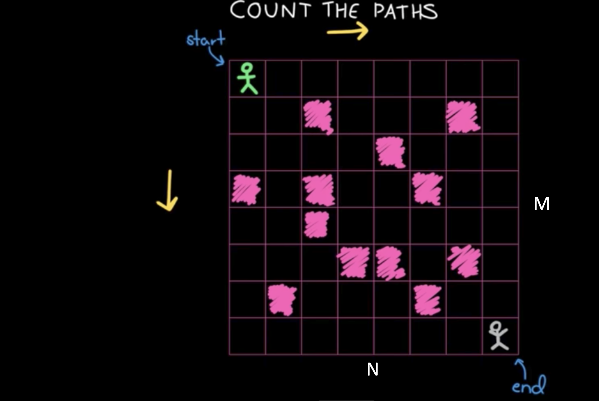
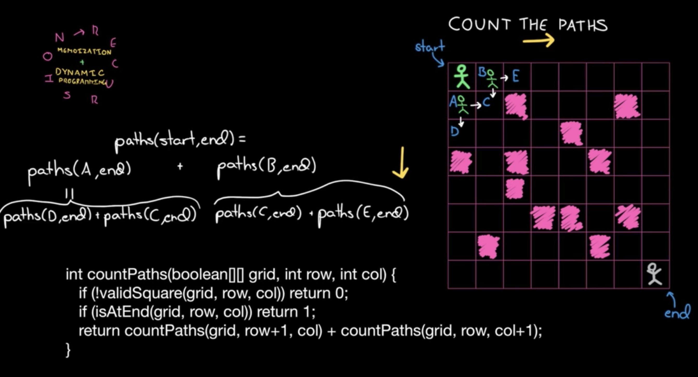
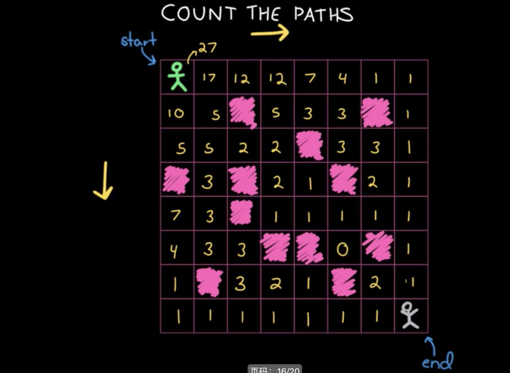

# 动态规划

1. 递归+记忆化 —> 递推
2. 状态的定义:opt[n], dp[n], fib[n]
3. 状态转移⽅方程:opt[n] = best_of(opt[n-1], opt[n-2], ...) 4. 最优⼦子结构

如果看不出来地推方程，可以先用递归+记忆优化的方式得到地推方程；然后根据递推方程定义状态转移方程

# 斐波那契数列问题举例
0, 1, 1, 2, 3, 5, 8, 13, 21, ... 递推公式:F[n] = F[n-1] + F[n-2]

## 自上而下的方式
### 递归


### 代码实现
```
int fib(int n) {
    return n<=1?n:fib(n-1)+fib(n-2);
}
```

### 递归+记忆优化(备忘录)


## 自下而上
递归 + 记忆化 ==> 递推 

递推公式:F[n] = F[n-1] + F[n-2]

```
F[0] = 0; F[1] = 1;
for (int i=2;i<n;i++) {
    F[i] = F[i-1] + F[i-2];
}
```

# 计算路径数




## 递归




## 自下而上




# 动态规划 vs 回溯 vs 贪⼼心算法
• 回溯(递归)— 重复计算

• 贪⼼心算法 — 永远局部最优

• 动态规划 — 记录局部最优⼦子结构 / 多种记录值