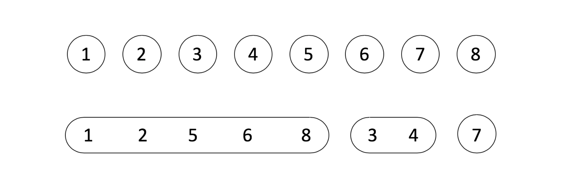
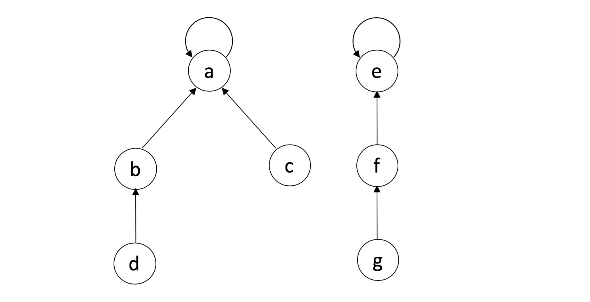
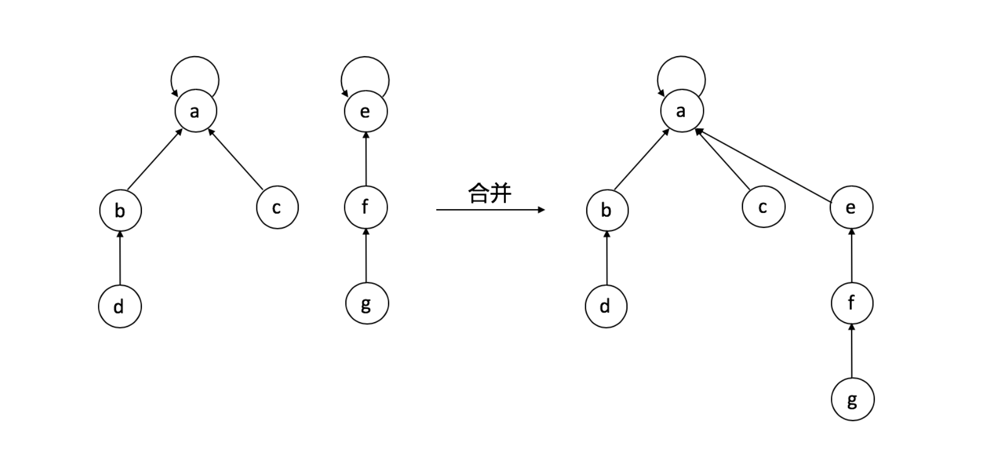
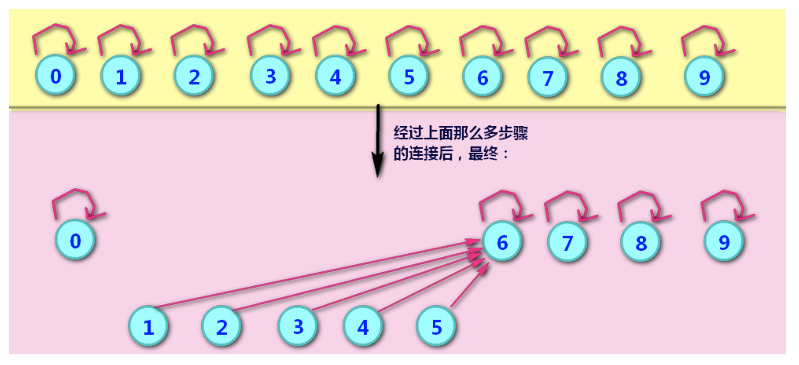
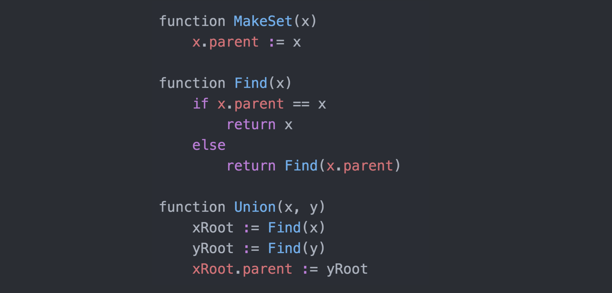
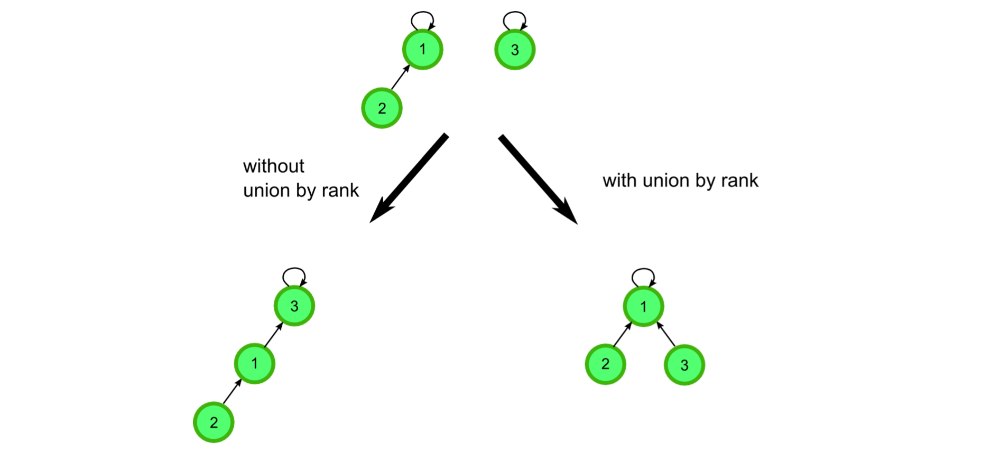
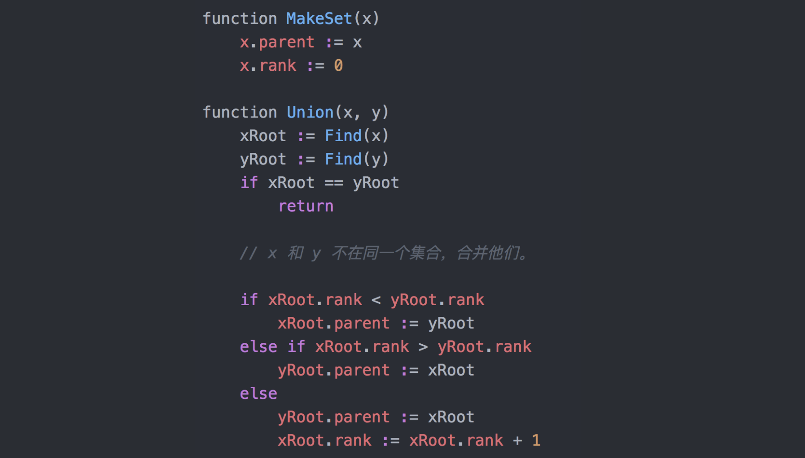
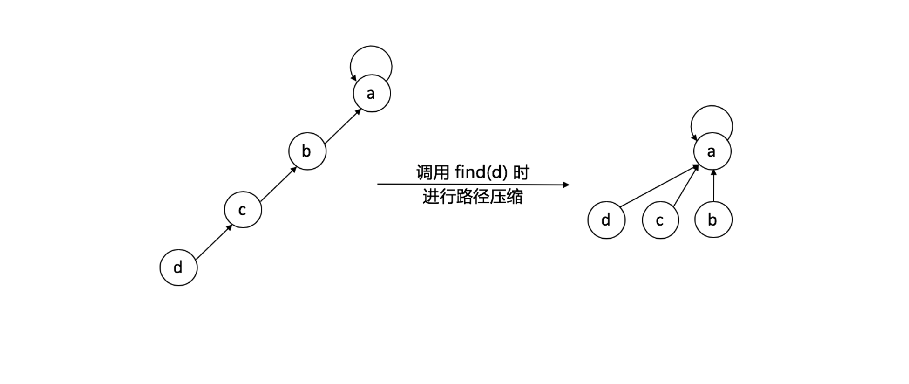
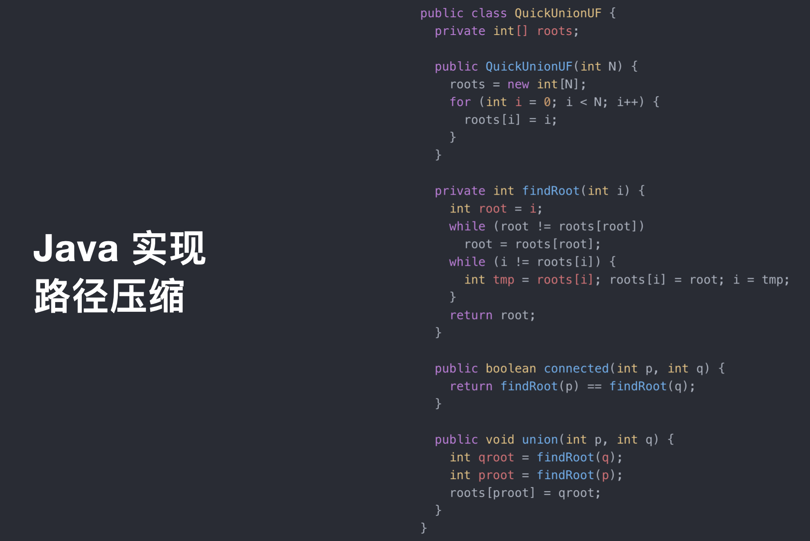

# 并查集

> 介绍

并查集->     并查集是一种数据结构, 常用于描述集合,经常用于解决此类问题:某个元素是否属于某个集合,或者 某个元素 和 另一个元素是否同属于一个集合

并查集 (union & find) 是⼀一种树型的数据结构，⽤用于处理理⼀一些不不交 集(Disjoint Sets)的合并及查询问题。
Find:确定元素属于哪⼀一个⼦子集。它可以被⽤用来确定两个元素是否 属于同⼀一⼦子集。
Union:将两个⼦子集合并成同⼀一个集合。

形象一点的图示

## 并查集伪代码

## 并查集优化

### 合并优化

合并的时候，A合并到B上还是B合并到A上；根据A和B的深度来决定；将深度短的合并到深度长的上面；只需要在合并时判断一下深度即可；同时需要维护深度。

并查集优化1代码

### 压缩优化

