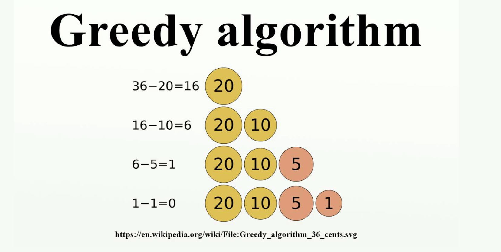

# 贪心算法

贪⼼心 Greedy
贪⼼心法，⼜又称贪⼼心算法、贪婪算法:在对问题求解 时，总是做出在当前看来是最好的选择。

贪心算法举例： 

# 贪心算法使用场景
适⽤用 Greedy 的场景 简单地说，问题能够分解成⼦子问题来解决，⼦子问题的最优解能递推到最终问题
的最优解。这种⼦子问题最优解成为最优⼦子结构。
贪⼼心算法与动态规划的不不同在于它对每个⼦子问题的解决⽅方案都做出选择，不不能 回退。动态规划则会保存以前的运算结果，并根据以前的结果对当前进⾏行行选择， 有回退功能。