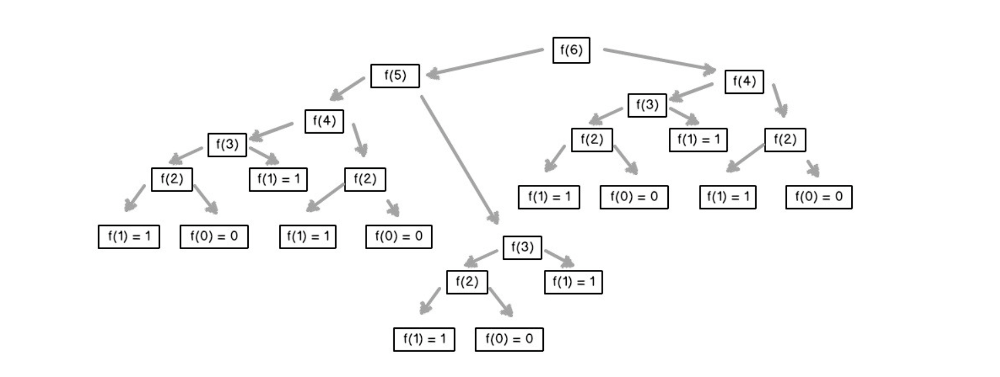
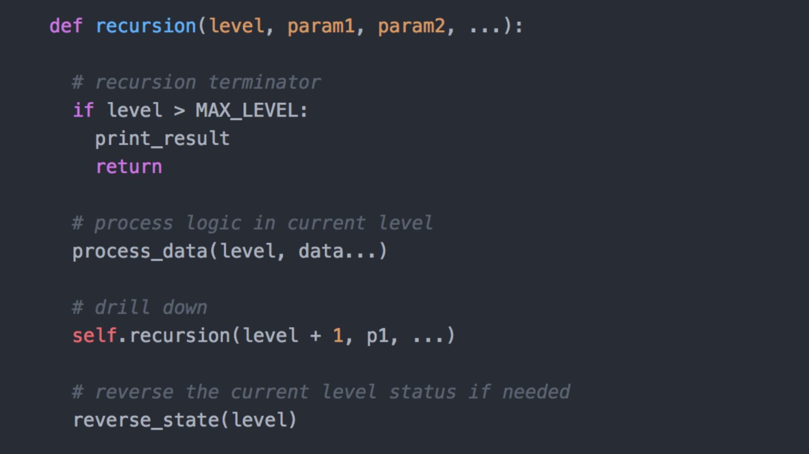
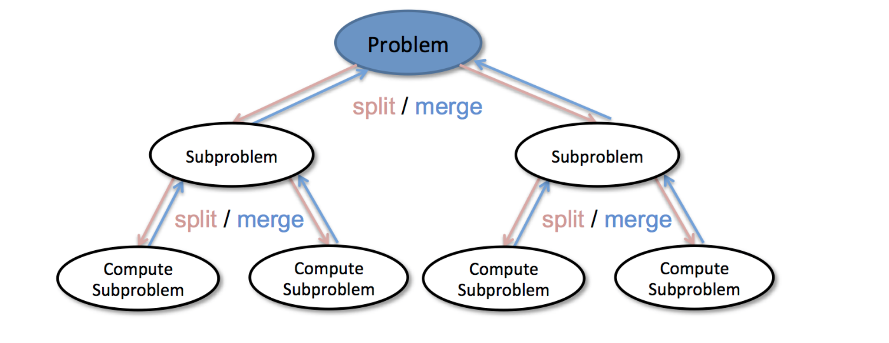
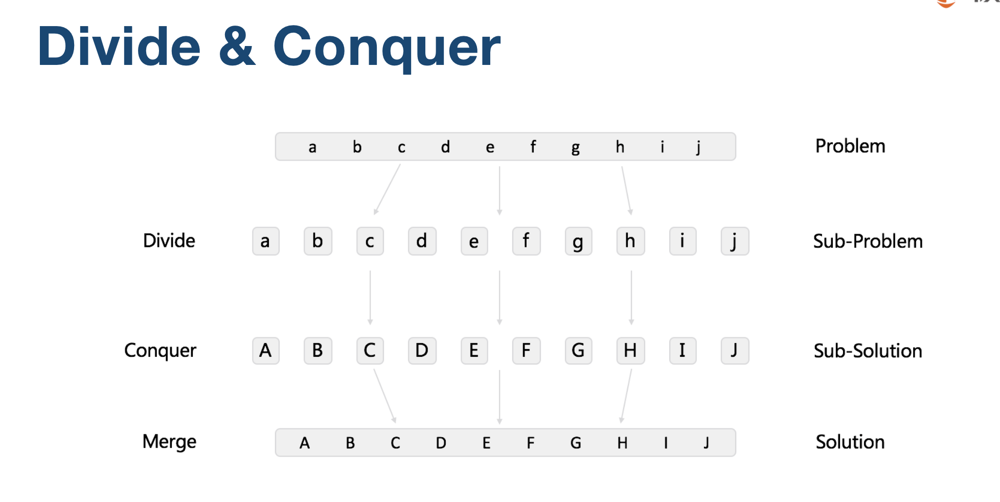
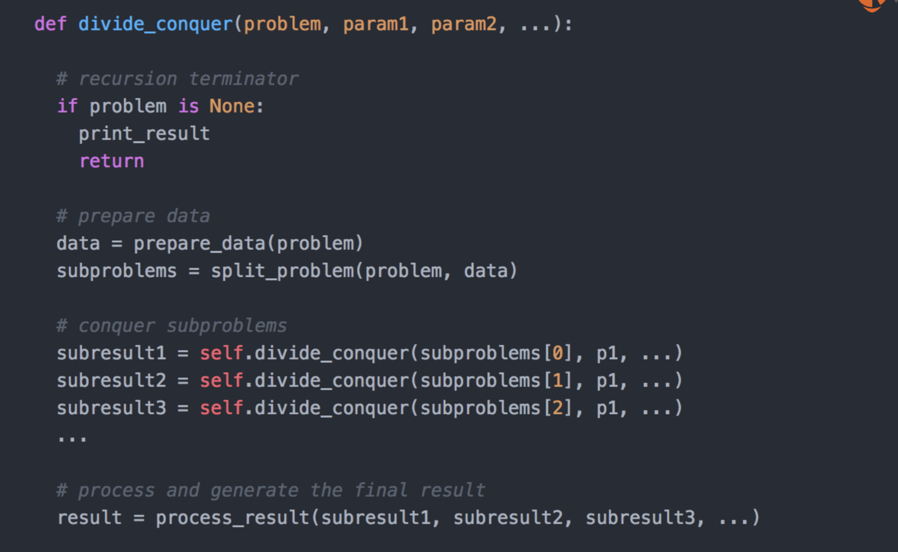

# 递归

递归

1. 从前有个⼭山， 
2. ⼭山⾥里里有个庙， 
3. 庙⾥里里有个和尚讲故事:


## 举例
计算 n!
n! = 1 * 2 * 3 * ... * n

```
def factorial(n)
    if n<=1:
        return 1
    return n * factorial(n-1)
```

Fibonacci array: 1, 1, 2, 3, 5, 13, 21, 34, ...
F(n) = F(n-1) + F(n-2)

```
def fib(n):
    if (n <= 1):
        return n
    return fib(n - 1) + fib(n - 2) 
```



问题：存在重复的子问题；
解决方式：备忘录法(缓存中间结果)

## 递归模板



# 分治



分治举例



## 分治模板

